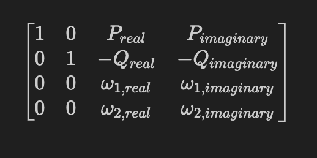
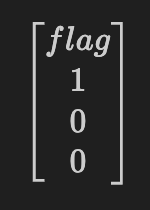

# Crocodile
- Category: Crypto
- Solves: 0
- Finals Challenge
## Description
sand beats paper. *one* 

sand beats rock. *line* 

sand beats scissors. *crypto* 

...what beats sand?
## Foreword
This was the hardest challenge of the CTF, which got zero solves. However, I managed to upsolve the challenge shorty after the CTF. I would rate this challenge a 10/10 for it was extremely enjoyable to solve.
## Prerequisites
To understand this writeup, the following knowledge is required:
1. Basic group theory, including homomorphisms and isomorphisms
2. The group of points on an elliptic curve of the form $y^2=x^3+ax+b$
3. Complex numbers
4. Lattices and how to apply lattice basis reduction algorithms

With that being said, let's begin!
## The Challenge
We are given the challenge distribution as follows:
```py
assert str((int.from_bytes(input("sctf{").encode(),"big")*EllipticCurve(ComplexField(600),[ComplexField(600)(-1493709/1024+1199/16*ComplexField(600)("i")),ComplexField(600)(97809777/8192-82731/128*ComplexField(600)("i"))]).lift_x(ComplexField(600)(f"1.{int.from_bytes(b'Suna Suna','big')}+1.{int.from_bytes(b'no Mi','little')}*i")))[0])=='36.4291990977855760916612664879030519474485549227993825161538502715951674771375534061669588110611144482794597140078219632113930698630358361379569599632450344672544557014134877316071 - 15.5094169179867261746136693539618921556037112420771075014010650669426508111314380331723075069743390329380360196986670381926994761597803212368978601671191064945527021806868498686789*I' and not print('\033[43C\033[1A}')
```
We can vaguely identify that the challenge is to solve the Elliptic Curve Discrete Logarithm Problem (ECDLP) over a field of complex numbers, but this is still quite confusing. We can simplify the code into the below:
```py
flag = b'sctf{redacted}'.lstrip(b'sctf{').rstrip(b'}')
assert len(flag) == 38

E = EllipticCurve(ComplexField(600),[ComplexField(600)(-1493709/1024+1199/16*ComplexField(600)("i")),ComplexField(600)(97809777/8192-82731/128*ComplexField(600)("i"))])
P = E.lift_x(ComplexField(600)(f"1.{int.from_bytes(b'Suna Suna','big')}+1.{int.from_bytes(b'no Mi','little')}*i"))
Q = int.from_bytes(flag)*P
print(str(Q.xy()[0]))
# output: 36.4291990977855760916612664879030519474485549227993825161538502715951674771375534061669588110611144482794597140078219632113930698630358361379569599632450344672544557014134877316071 - 15.5094169179867261746136693539618921556037112420771075014010650669426508111314380331723075069743390329380360196986670381926994761597803212368978601671191064945527021806868498686789*I
```
Once again, this is a very standard ECDLP-breaking challenge, where the scalar is the flag, and with the clear vulnerability being that the numbers are over a complex field.  
## The Weierstrass-℘ Function
The Weierstrass-℘ Function, or the Weierstrass-p Function, which I will be referring to it by, is an infinite series which has terms depending on the equation of the elliptic curve which it concerns, and is also the solution to a specific differential equation:
$$℘'(z)^2 = 4℘(z)^3−g_2℘(z)−g_3$$
Hang on a second, this equation looks familiar...isn't this an elliptic curve? Well, yes, it is an elliptic curve, with $y=℘'(z)$ and $x=℘(z)$.    

However, as mentioned earlier, we are representing elliptic curves in the form $y^2=x^3+ax+b$, so the coefficient of $x^3$ is $1$. Thankfully, by substituting $y=\frac{1}{2}y$, we can reduce the equation to the form $y^2=x^3+ax+b$.  

So, what does this mean? We have found that a complex number, $u$, can be mapped by an isomorphism to a point on an elliptic curve $(℘(u),\frac{1}{2}℘'(u))$.  

Since this is an isomorphism, there is an inverse. Importantly, we don't actually need to find the inverse of the derivative of the Weierstrass-p Function, as we can just take the $x$-coordinate of the point in question and calculate $℘^{-1}(P_x)$. Regardless, we can accomplish this using newer versions of `SageMath`, as shown in the code below:
```py
Pu = E.period_lattice().e_log_RC(*(P.xy()))
```
> The reason why the method `period_lattice()` is called is because the isomorphism we're using here is from elliptic curves over complex numbers to period lattices which can be used to construct complex tori, but I'm going about this writeup with a focus on explaining using the Weierstrass-p Function and its periodicity (see below for periodicity), so I will not be touching on period lattices or complex tori.

Hence, we can map elliptic curve point addition to point addition over numbers, just like in Smart's Attack, so we can just perform direct division...right? Well, not really.
## Periodicity
The function ℘ is doubly periodic. While that sounds abstract, let me illustrate with a simpler example.  
If $\sin(x) = y$, is $x = \sin^{-1}(y)$? No, $x = \sin^{-1}(y)+2k\pi, k \in \mathbb{Z}$. This is because $\sin(x)=\sin(x+2k\pi),k \in \mathbb{Z}$. The $\sin$ function is singly periodic.  
Double periodicity means that there are two linearly independent values of $\omega$ such that $℘(x+\omega) = ℘(x)$. These values are also known as "periods".  

Therefore, we can reduce our problem to $flag*P_u = Q_u+l\omega_1+m\omega_2, flag,l,m \in \mathbb{Z}$. 
### Finding $\omega$
The values of $\omega$ can be found by evaluating certain definite integrals, which I will not go into as, just like with the isomorphism, it is already implemented in newer versions of `SageMath` as shown below:
```py
omega1, omega2 = E.period_lattice().basis()
```
## Lattice Reduction
Now that we have the values of $\omega$, we have everything we need to solve the challenge! We can do so by using lattice reduction, or in particular, the Lenstra–Lenstra–Lovász (LLL) lattice basis reduction algorithm.  

Since LLL only returns results for integers on both the left-hand-side and right-hand-side vectors, it is perfect for our usage.  
But wait, LLL doesn't operate in complex numbers! Since we are only multiplying our complex numbers by real integers, we are only operating with addition over complex numbers. This means that complex numbers will behave exactly like degree-1 polynomials in terms of $i$. As we know, addition of polynomials is simply addition of coefficients, which means we can just use two separate columns of the lattice for our constraints.  

I ended up using the below lattice  
  
This lattice should recover the vector  
  
After weighing the columns properly, we end up retreving the flag: `sctf{water_beats_sand!..in_arabasta,that_is}`. Truly a _One Piece_ reference.  

We can verify that it indeed passes the `assert` test in the challenge code.
## Solve Script
My solve script is in `solve.sage`.  
To fulfill the spirit of the challenge, I also golfed the script into a one-line solve, including the original assert check:
```py
assert str(((flag := (abs(int(Matrix(QQ,[[1,0,2**512*QQ((F:=RealField(600))((L:= (E:=EllipticCurve(ComplexField(600),[ComplexField(600)(-1493709/1024+1199/16*ComplexField(600)("i")),ComplexField(600)(97809777/8192-82731/128*ComplexField(600)("i"))])).period_lattice()).e_log_RC(*((P := E.lift_x(ComplexField(600)(f"1.{int.from_bytes(b'Suna Suna','big')}+1.{int.from_bytes(b'no Mi','little')}*i"))).xy())).real())),2**512*QQ(F(L.e_log_RC(*(P.xy())).imag_part()))],[0,2**300*1,2**512*-QQ(F(L.e_log_RC(*((Q := E.lift_x(ComplexField(600)(36.4291990977855760916612664879030519474485549227993825161538502715951674771375534061669588110611144482794597140078219632113930698630358361379569599632450344672544557014134877316071 - 15.5094169179867261746136693539618921556037112420771075014010650669426508111314380331723075069743390329380360196986670381926994761597803212368978601671191064945527021806868498686789*I))).xy())).real())),2**512*-QQ(F(L.e_log_RC(*(Q.xy())).imag_part()))],[0,0,2**512*QQ(F(L.basis()[0].real())),2**512*QQ(F(L.basis()[0].imag_part()))],[0,0,2**512*QQ(F(L.basis()[1].real())),2**512*QQ(F(L.basis()[1].imag_part()))]]).LLL()[0][0]))))*P)[0]) == str(Q[0]) and not print('sctf{'+flag.to_bytes(38).decode()+'}')
```